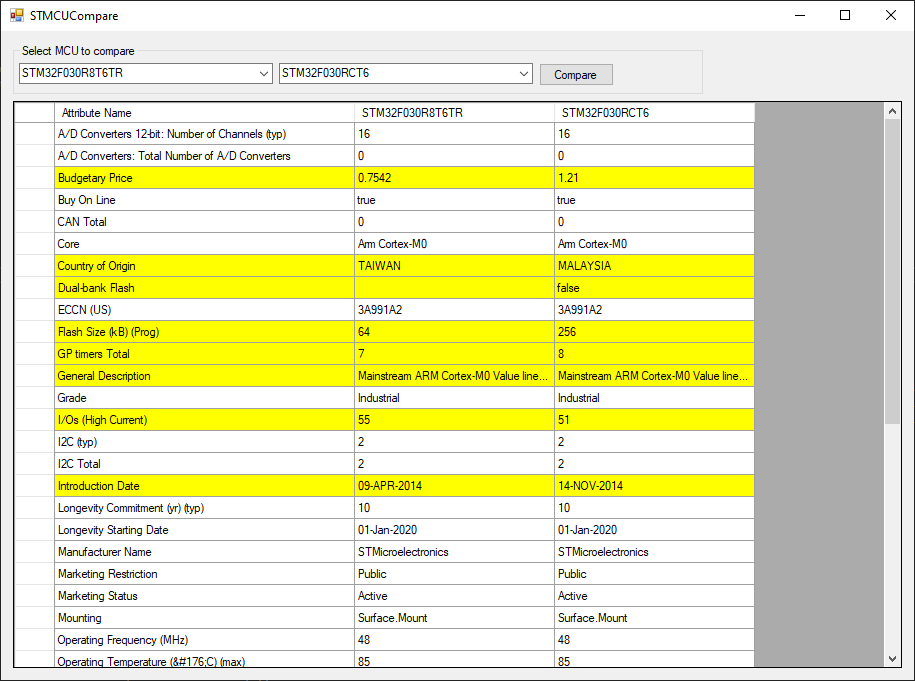

# STMCUCompare
Tool for comparing STM32 MCUs. 

First, extract **cube-finder-db.db** into application directory from one of these locations:
* **STM32CubeIDE**: STM32CubeIDE\plugins\com.st.stm32cube.common.mx_*\db\plugins\mcufinder\mcu\cube-finder-db.zip 
* **STM32Cube**: C:\Program Files\STMicroelectronics\STM32Cube\STM32CubeMX\db\plugins\mcufinder\mcu\cube-finder-db.zip

## Main window

